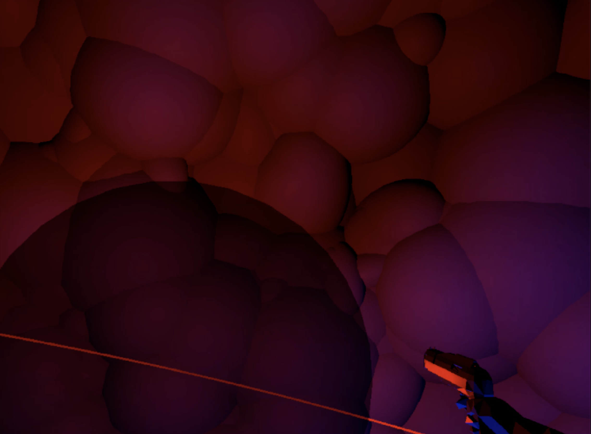

[Youtube Video](https://www.youtube.com/watch?v=K99MYm-NKZA&feature=youtu.be)

# Blindslinger

Blindslinger is an experiment meant to demonstrate our ability to localize sources of sounds in three-dimentional space. A sphere is spawned and moves in a circular motion(can also be made stationary) around the player, looping an audio file. Using a spatializer, the sound not only changes according to it's position in the horizontal plane, but also reflects it's position in the vertical plane(above, underneath, or behind the user, etc). The user shoots the sphere, spawning a another one with a new position/trajectory. The spheres gradually becomes transparent as they are hit, until they are entirely invisible and the highlighted trajectory(colored red in the image) dissappears. Thus, the user is left with only their auditory sense to guide them. 

### Controls
The user is placed on a suspended platform, with a static gun-holding arm locked to the user's view. VR controllers are not used for tracking and is therefore not rendered; their only purpose is using their trigger for shooting. This is is order for the projectile to shoot consistently in a perfect forward-facing motion from the users face. 

## Background
Having two ears is generally enough to localize sounds in the horizontal plane. In order to pinpoint a sound this space, the brain primarily uses two cues:

1. The interaural level difference (ILD) is the difference in loudness in one ear compared to the other.  

2. The interaural time difference (ITD) is the difference in the timing of the sound entering one ear compared to the other. 

A sound coming from the left will sound somewhat louder to the left ear than it does to the right ear. The brain picks up on that to determine where a sound is coming from. Similarly, the brain determines that a sound came from the left if it entered the left ear before it entered the right ear. 

This basic capability is common for most mammals; the two ears usually correspond to the horizontal plane, and as such can easily localize these sounds. However, many mammals cannot easily pinpoint sounds in the longitudinal plane(any angle between above, in front of, below and behind the listener). Primates are another story. Our auditory receptors does not have high fidelity compared to other mammals, but we have world-class sound localization abilities. We can precisely pinpoint sounds in all directions, including the longitudinal plane. 

A sound coming from above sounds different than an identical one coming from below, as the sound is affected by our body and the shape of our ears and ear canals. The processing power required to distinguish these variations are considerable, so it's our brains that enable us to localize the sources of sounds with such precision. 

## Spatial sound in VR

In most traditional first-person games, it is often enough to have the soundscape in the horizontal plane. In VR however, this is not optimal. If a VR experience doesn’t have realistic audio to match the visuals, it will break immersion. Considering that the benefits of VR are more pronounced when you’re fully immersed in it, this must be addressed. 

Using stereo headphones, directional sounds in the horizontal plane are easily implemented. On the other hand, in order to make sounds appear as though they come from any direction, the audio must be modified based on the orientation of the player's head to simulate how it would be percieved in the real world. This can be achieved through head-related transfer function (HRTF). HRTF can simulate realistic sounds in a number of different ways, but in this case a pair of HRTFs for two ears can be used to synthesize a binaural sound that seems to come from a any point in space.

In this demo, HRTF is implemented in Unity through the Oculus Spatializer. 

## Equipment used
The demo has only been tested on HTC Vive with Vive Controllers. Other HMDs should work, but it might be nessecary to use mouse-click to shoot.  

## Links
* [SmarterEveryDay video](https://www.youtube.com/watch?v=Oai7HUqncAA&t=322s) on the subject
* [VR Audio Spatializer](https://docs.unity3d.com/Manual/VRAudioSpatializer.html) documentation (Unity)
* [Oculus Spatializer](https://developer.oculus.com/documentation/unity/audio-osp-unity/) documentation (Unity)
* https://www.cbinsights.com/research/vr-audio-tech/
* https://circuitstream.com/blog/your-guide-to-spatial-audio-in-vr/
